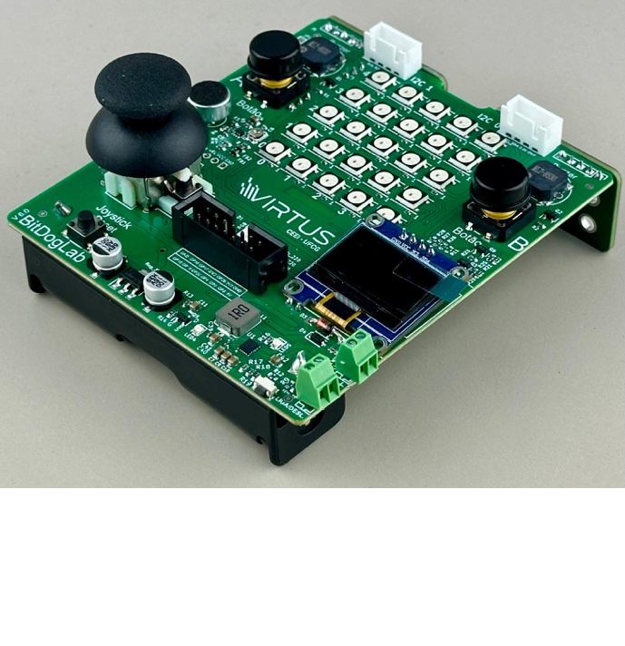

# Projeto de Controle de Matriz de LED com Joystick - VIRTUS-CC
<p align="center">
  
</p>

## Autores

- [Antonio Roberto](https://github.com/antoniojunior2222)
- [Ismael Marinho](https://github.com/smalljooj)

Este projeto tem como objetivo controlar uma matriz de LED 5x5 utilizando um joystick. O joystick é utilizado para selecionar direções e exibir sprites correspondentes na matriz de LED. O projeto foi desenvolvido para a plataforma Raspberry Pi Pico, utilizando as bibliotecas `joystick_lib` e `malha_led`.

## Montagem do Projeto




### Componentes Utilizados

- 1x Placa Bitdoglab
- 1x Joystick (com eixos X e Y e botão)
- 1x Matriz de LED 5x5 (WS2812B/NeoPixel)
- 1x Botão adicional (opcional, para mudança de cores)

### Conexões

- **Joystick**:
  - Eixo X: GPIO 26
  - Eixo Y: GPIO 27
  - Botão: GPIO 22
- **Matriz de LED**:
  - Barramento de dados: GPIO 7
- **Botão Adicional**:
  - GPIO 5

## Funções Implementadas com Bibliotecas

### **Biblioteca do Joystick (`joystick_lib`)**

A biblioteca `joystick_lib` é responsável por ler os valores do joystick e normalizá-los para um intervalo de -100 a 100. Ela também gerencia interrupções para o botão do joystick e um botão adicional.

#### Funções Principais:

1. **`void init_joystick()`**
   - **Descrição**: Inicializa o joystick, configurando os pinos GPIO e ADC para leitura dos eixos X e Y, e os botões.
   - **Detalhes**:
     - Configura os pinos 26 e 27 para leitura analógica dos eixos X e Y.
     - Configura os pinos 22 e 5 como entradas para os botões, com resistores pull-up.
     - Configura interrupções para detectar bordas de subida nos botões.

2. **`void joystick_captura()`**
   - **Descrição**: Captura os valores atuais do joystick (eixos X e Y) e o estado do botão.
   - **Detalhes**:
     - Chama a função `inplicit_read_joystick` para atualizar os valores dos eixos e do botão.

3. **`void normalizar_joystick()`**
   - **Descrição**: Normaliza os valores dos eixos X e Y para um intervalo de -100 a 100.
   - **Detalhes**:
     - Usa os valores brutos do ADC (0-4095) e os mapeia para -100 (esquerda/baixo) a 100 (direita/cima), com 0 sendo o centro.

4. **`void botao_interrupcao(uint gpio, uint32_t events)`**
   - **Descrição**: Função de callback para tratar interrupções dos botões.
   - **Detalhes**:
     - Alterna a cor tema da matriz de LED entre vermelho, verde e azul quando o botão do joystick é pressionado.
     - Alterna tons pastel quando o botão adicional é pressionado.

5. **`int16_t get_joystick_x_norm()` e `int16_t get_joystick_y_norm()`**
   - **Descrição**: Retornam os valores normalizados dos eixos X e Y, respectivamente.
   - **Retorno**: Valor no intervalo de -100 a 100.

---

### **Biblioteca da Matriz de LED (`malha_led`)**

A biblioteca `malha_led` controla uma matriz de LED 5x5, permitindo a exibição de sprites e a alteração dinâmica das cores.

#### Funções Principais:

1. **`void npInit()`**
   - **Descrição**: Inicializa a matriz de LED, configurando o PIO e a máquina de estados.
   - **Detalhes**:
     - Configura o pino 7 para controle dos LEDs NeoPixel.
     - Inicializa o buffer de pixels com todas as cores definidas como preto.

2. **`void npSetLED(uint index, uint8_t intensidade)`**
   - **Descrição**: Define a cor de um LED específico na matriz.
   - **Parâmetros**:
     - `index`: Índice do LED (0 a 24).
     - `intensidade`: Intensidade do LED (0-255), que é multiplicada pela cor tema.

3. **`void npClear()`**
   - **Descrição**: Limpa a matriz de LED, definindo todas as cores como preto.
   - **Detalhes**:
     - Útil para reiniciar a exibição antes de desenhar um novo sprite.

4. **`void npWrite()`**
   - **Descrição**: Envia os dados do buffer de pixels para os LEDs.
   - **Detalhes**:
     - Deve ser chamada após definir as cores dos LEDs para atualizar a matriz.

5. **`void display_sprite(const int sprite[5][5][3])`**
   - **Descrição**: Exibe um sprite na matriz de LED.
   - **Parâmetros**:
     - `sprite`: Matriz 5x5x3 contendo os valores de intensidade para cada LED.

6. **`int getIndex(int x, int y)`**
   - **Descrição**: Converte coordenadas (x, y) em um índice linear.
   - **Retorno**: Índice linear correspondente (0 a 24).

---

## Funções Implementadas no `main`

O arquivo `joystick.c` é o ponto de entrada do projeto. Ele integra as bibliotecas do joystick e da matriz de LED, implementando a lógica principal do projeto.

### **Lógica Principal**

1. **Inicialização**:
   - O joystick e a matriz de LED são inicializados.
   - O microfone é configurado (opcional, não utilizado no momento).

2. **Loop Principal**:
   - O joystick é lido e os valores são normalizados.
   - A direção do joystick é determinada usando a função `get_direcao()`.
   - O sprite correspondente à direção é exibido na matriz de LED.

3. **Controle de Sprites**:
   - Dependendo da direção do joystick, um sprite específico é exibido (ex: `cima1`, `esq2`, `dircim1`, etc.).
   - Se o joystick estiver na posição neutra, o sprite `neutro` é exibido.

4. **Atualização da Matriz**:
   - Após definir o sprite, a função `npWrite()` é chamada para atualizar a matriz de LED.

---

## Instruções

### Como Compilar e Executar

1. **Requisitos**:
   - Compilador ARM GCC (`arm-none-eabi-gcc`).
   - SDK da Raspberry Pi Pico.

2. **Compilação**:
   - Compile o projeto usando o CMake:
     ```bash
     mkdir build
     cd build
     cmake ..
     make
     ```

3. **Execução**:
   - Conecte a Raspberry Pi Pico ao computador via USB.
   - Carregue o arquivo `.uf2` gerado na Pico.

4. **Interação**:
   - Movimente o joystick para controlar a exibição dos sprites na matriz de LED.
   - Pressione o botão do joystick para alternar entre as cores tema (vermelho, verde, azul).
   - Pressione o botão adicional para alternar entre tons pastel.

---

## Conclusão

Este projeto demonstra a integração de um joystick com uma matriz de LED, permitindo o controle dinâmico de sprites e cores. A utilização de interrupções e normalização de valores do joystick garante uma experiência responsiva e precisa. Possíveis melhorias incluem a adição de mais sprites, suporte a mais botões ou a integração de outros sensores.

---

## Fontes

- [Raspberry Pi Pico SDK](https://github.com/raspberrypi/pico-sdk)
- [Biblioteca NeoPixel para Pico](https://github.com/raspberrypi/pico-examples/tree/master/pio/ws2812)
